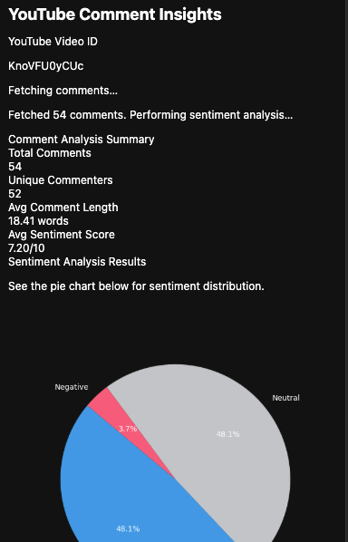

# sentiment-analysis-pipeline-with-MLOps

## Overview

This project implements an **end-to-end YouTube sentiment analysis
pipeline** using **MLOps best practices**.\
It collects comments from YouTube videos, preprocesses them, trains a
machine learning model, tracks experiments with **MLflow**, manages data
pipelines with **DVC**, and serves predictions through a **Flask API**
integrated with a **Chrome Extension**.

The goal is to showcase a **production-grade MLOps pipeline** with
CI/CD, experiment tracking, data versioning, and deployment.

------------------------------------------------------------------------

## Features

-   **Data Ingestion**: Fetches YouTube comments via YouTube Data API
    v3.
-   **Data Processing**: Cleans, preprocesses, and splits data into
    train/test sets.
-   **Model Training**: Uses **LightGBM with TF-IDF vectorization** for
    sentiment classification.
-   **Experiment Tracking**: Logs metrics, models, and artifacts in
    **MLflow** (hosted on AWS EC2).
-   **Data Versioning**: Uses **DVC** for managing datasets and pipeline
    stages.
-   **Model Evaluation**: Evaluates predictions with accuracy,
    precision, recall, F1-score.
-   **Deployment**: Flask API serving predictions (`/predict`,
    `/predict_with_timestamps`).
-   **Visualization**: Word cloud, pie charts, sentiment trends over
    time.
-   **Chrome Plugin**: Easy-to-use extension that shows sentiment
    insights directly on YouTube.

------------------------------------------------------------------------

## Tech Stack

-   **Languages**: Python (3.12), JavaScript (for Chrome extension)
-   **Libraries**: scikit-learn, LightGBM, Pandas, NumPy, Matplotlib,
    WordCloud, Flask
-   **MLOps Tools**: MLflow, DVC
-   **Infrastructure**: AWS EC2, S3
-   **Frontend**: Chrome Extension (HTML, CSS, JS)

------------------------------------------------------------------------

## Workflow

Below is the architecture of the project:


1.  **Data Collection** → Fetch comments using YouTube Data API v3.
2.  **Data Ingestion (DVC)** → Store raw dataset (`data/raw`), version
    controlled with DVC.
3.  **Data Processing** → Preprocess comments, clean text, lemmatize,
    and remove stopwords.
4.  **Model Training (LightGBM + TF-IDF)** → Train sentiment model, log
    in MLflow.
5.  **Model Evaluation** → Evaluate on test set, save metrics &
    artifacts.
6.  **Experiment Tracking (MLflow)** → Run & compare experiments on AWS
    EC2 MLflow server.
7.  **Data & Pipeline Versioning (DVC)** → Automates pipeline stages via
    `dvc.yaml`.
8.  **Deployment (Flask API)** → Serve predictions locally & via EC2.
9.  **Chrome Extension** → Fetch insights (comment stats, sentiment
    distribution, wordcloud, trends).

------------------------------------------------------------------------

## Setup Instructions

### 1️⃣ Clone Repository

``` bash
git clone https://github.com/Nityanand7/sentiment-analysis-pipeline-with-MLOps.git
cd sentiment-analysis-pipeline-with-MLOps
```

### 2️⃣ Create Environment

``` bash
conda create -n mlops-pipeline python=3.12 -y
conda activate mlops-pipeline
pip install -r requirements.txt
```

### 3️⃣ Configure MLflow

-   Launch MLflow server on EC2:

``` bash
mlflow server -h 0.0.0.0 -p 5000 --default-artifact-root s3://your-bucket-name
```


-   Update tracking URI in `model_evaluation.py` & `app.py`.

### 4️⃣ Run DVC Pipeline

``` bash
dvc repro
```

### 5️⃣ Run Flask API

``` bash
python flask_app/app.py
```

(Default runs on port `5002`)

### 6️⃣ Run Chrome Extension

-   Load the `yt-chrome-plugin` folder in **Developer Mode** in Chrome
    extensions.
-   Enter your YouTube Data API key in `popup.js`.
-   Open any YouTube video → Get sentiment insights.

------------------------------------------------------------------------

## Example Output

-   **Comment Summary**: Total comments, unique commenters, average
    sentiment score.
-   **Visualizations**:
    -   Pie chart of sentiment distribution\
    -   Sentiment trend graph\
    -   Wordcloud of frequent words\
-   **Predictions**: Sentiment labels (`positive`, `neutral`,
    `negative`) for each comment.



------------------------------------------------------------------------

## Future Improvements

-   Deploy Flask API on **Docker + AWS ECS/Fargate**.
-   Integrate **CI/CD pipeline (GitHub Actions)**.
-   Use **Vertex AI / SageMaker** for managed training & deployment.
-   Add **real-time streaming** with Kafka/PubSub.
-   Extend Chrome plugin with **more detailed insights** (comment
    clustering, toxicity detection).

------------------------------------------------------------------------

